# flutter工程抓包

flutter工程无法使用类似charles抓包工具进行抓包，是因为http请求通过wifi没有走代理

通过更该http请求的代码可以实现代理，[实现方式请戳](https://juejin.cn/post/6844903794229116935), 但是这样的话针对测试来说太约束了，无法多人进行抓包测试。

## Android抓包

通过`Drony`软件可以设置个VPN代理，VNP代理到Charles，然后就可以抓包了
安装包放在`package`文件夹，直接安装即可

打开软件，看到如下页面
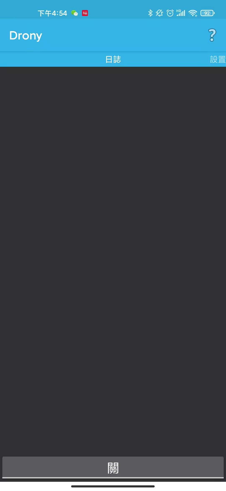

左滑进入到设置页面，点击无线网络
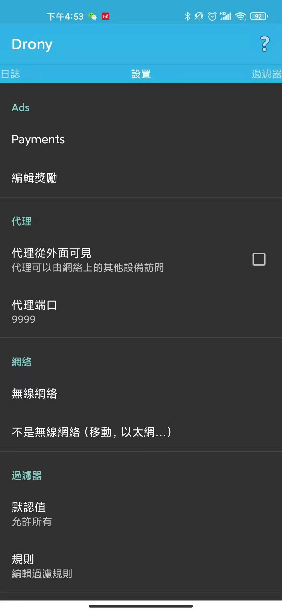

选择当前Wi-Fi，默认是第一个
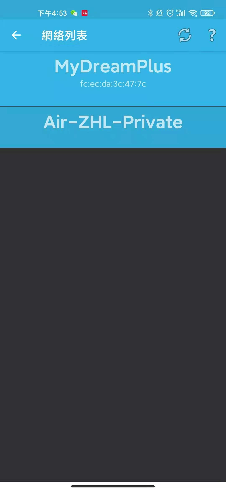

在网络里面添加Charles的主机名和端口
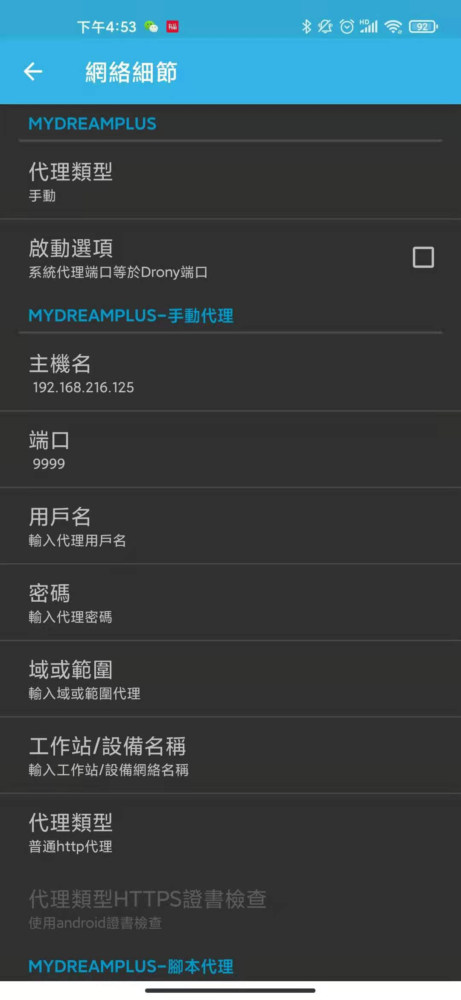

完成后回到首页，点击开就可以在Charles上进行抓包了
## ios
ios上有类似`Drony`的软件，这里使用`Shadowrocket`进行VPN的设置

安装方式：
  1、通过非大陆`appleId`，直接在`appStore`中进行下载
  2、通过ipa文件进行安装，安装包同样放在了`package`文件夹，电脑采用爱思助手数据线连接手机，通过加载本地文件安装到手机上

打开app显示如下，服务器节点默认是没有的，点击右上角添加节点
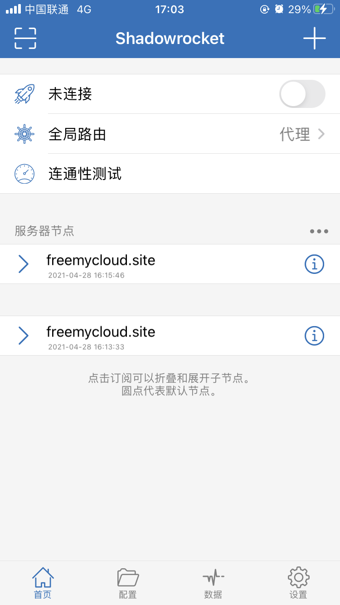

同样地址和端口添加Charles的配置
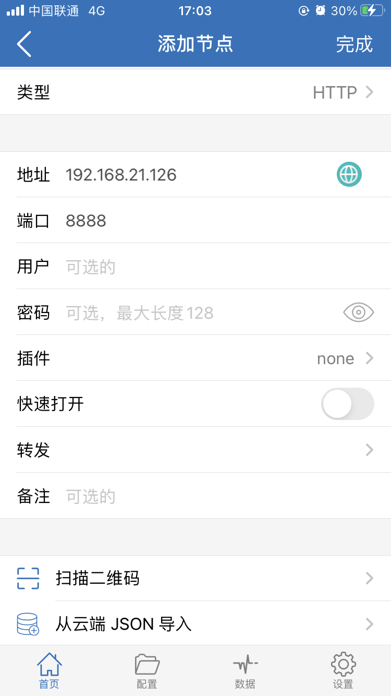

完成后选中添加的节点，点击连接后就可以抓包了
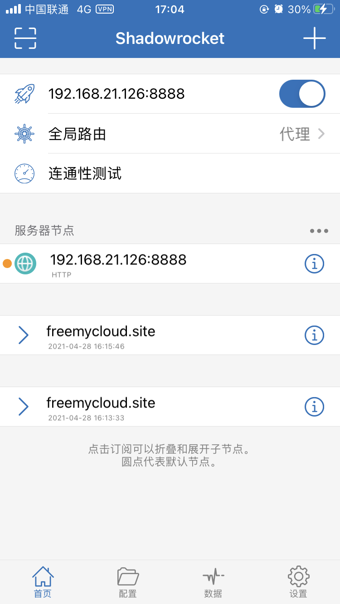

## Charles

找到 Proxy - SSL Proxying Settings，点击 Add，Host填* prot填443。
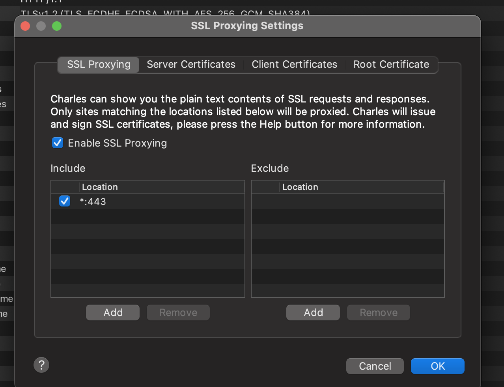

手机访问`chls.pro/ssl` 下载并安装描述文件

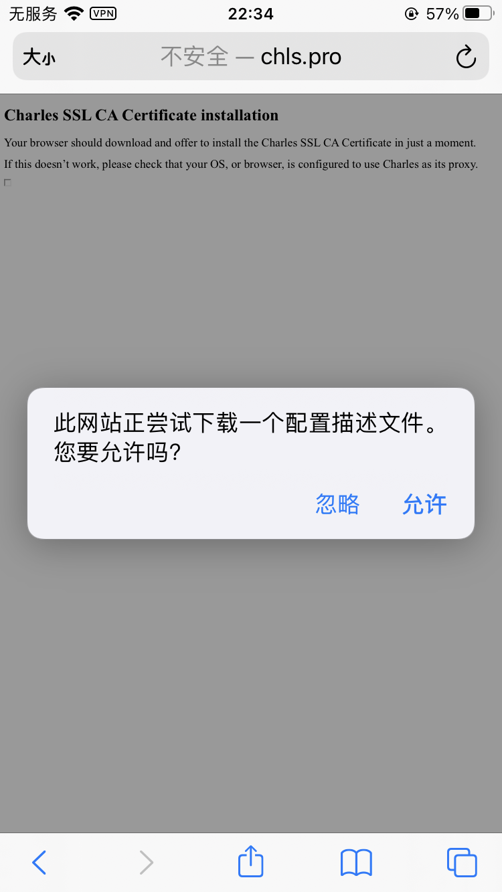

## QA

1、https请求报错SSL handshake with client failed
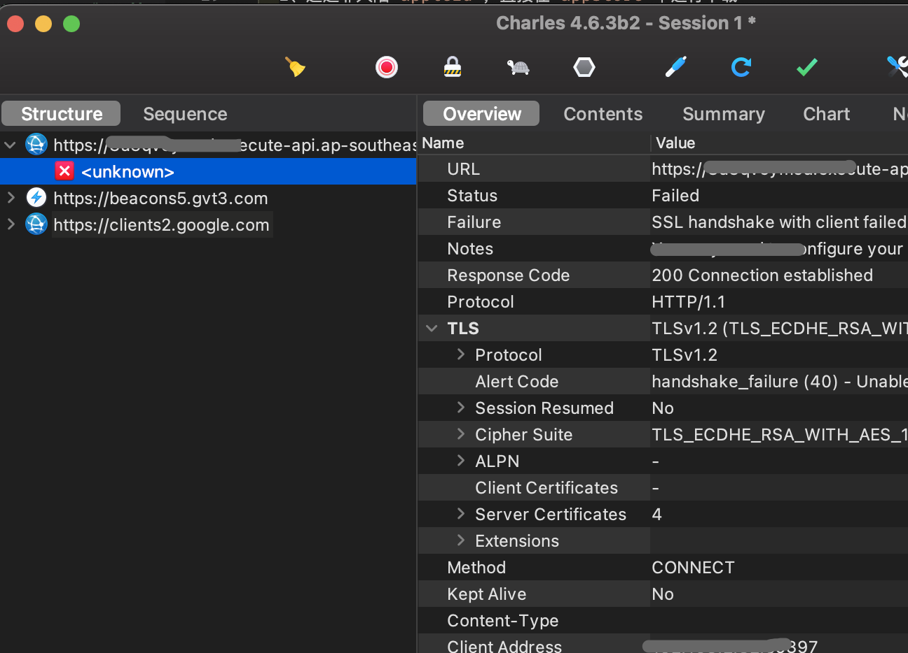
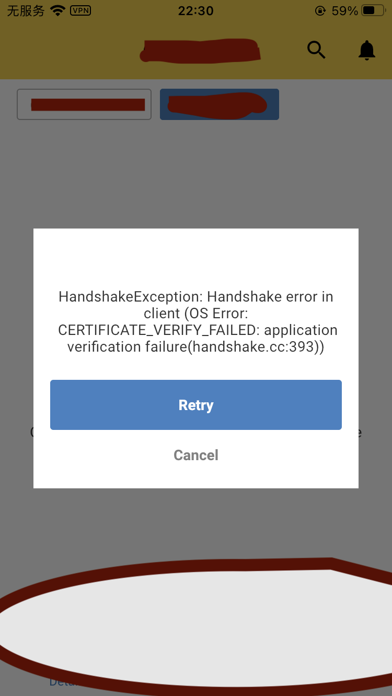

iPhone上依次选择 设置-通用-关于本机-证书信任设置，将Charles证书勾选完全信任
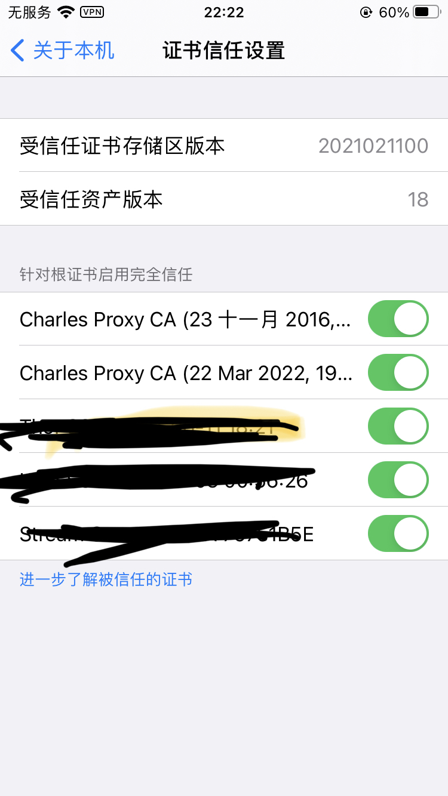
