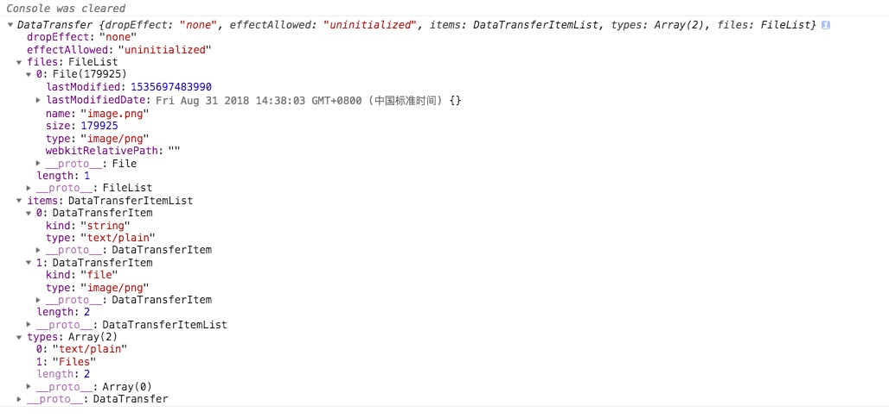
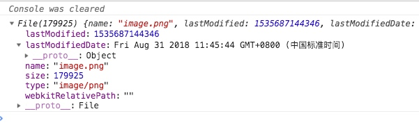
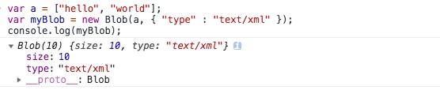
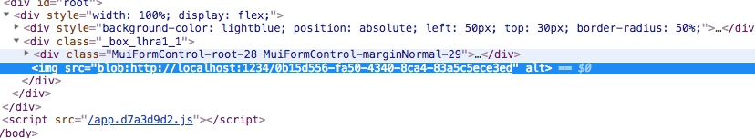
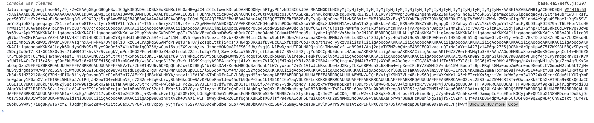

# 图片流

前端所说的图片流就是读取本地图片，并在页面使用文件流的方式显示出来。

首先，我们简单说下文件上传的几种方式

## 上传方式

### input

通过用户点击，创建`<input type="file" accept="image/*"/>`,并监听`change`事件获取file对象，大体如下
```js
click = () => {
    let input = document.createElement('input')
    input.setAttribute('type', 'file')
    input.setAttribute('accept', 'image/*')
    
    input.onchange = event => {
        let file = event.target.files[0]
    }
    
    input.click()
    
} 
```

### Drag && drop

使用HTML5的拖放API，监听元素的`drop`事件，同样是获取file对象

会创建一个DataTransfer对象,下面我们还会遇到它，稍后再说


```js
dragover = event => {
   event.preventDefault()
}

drop = event => {
    event.preventDefault()
    let files =  event.dataTransfer.files
}
```

### paste

给元素绑定粘贴事件，得益于`contenteditable`我们可以给所有元素添加，涛声依旧，获取event中包含的file

```js
paste = (e) => {
    e.preventDefault()
    let file = e.clipboardData.files[0]
}
```

#### clipboardData
paste事件提供了一个`clipboardData`属性，是一个`DataTransfer`类型的对象，前面我们说到，拖放会产生一个`DataTransfer`对象，没错，粘贴也是它。

来来来，掀起了她的盖头来。



上面可以看到，`clipboardData`有如下属性

+ dropEffect 默认是node
+ effectAllowed 默认是uninitialized
+ files 本地文件列表
+ items 剪切板中的各项数据
+ types 剪切板中的各项数据类型

我们只需要使用files即可，图片文件在它里面

##  文件格式

### file

> 通常情况下， File 对象是来自用户在一个`<input>`元素上选择文件后返回的 `FileList` 对象,也可以是来自由拖放操作生成的`DataTransfer`对象，继承于`Blob`

庐山真面目，诺，就是这个样子。



可以看到有如下属性：

+ name：文件名，该属性只读。
+ size：文件大小，单位为字节，该属性只读。
+ type：文件的 MIME 类型，如果分辨不出类型，则为空字符串，该属性只读。
+ lastModified：文件的上次修改时间，格式为时间戳。
+ lastModifiedDate：文件的上次修改时间，格式为 Date 对象实例。

我们不去深究file对象，只需要知道通过它可以访问本地的文件。

### blob
> 一个 Blob对象表示一个不可变的, 原始数据的类似文件对象。Blob表示的数据不一定是一个JavaScript原生格式。 File 接口基于Blob，继承 blob功能并将其扩展为支持用户系统上的文件。

#### 创建blob对象

```js
var aBlob = new Blob( array, options );
```
+ array 是一个由ArrayBuffer, ArrayBufferView, Blob, DOMString 等对象构成的 Array ，或者其他类似对象的混合体，它将会被放进 Blob.

+ options 是一个可选的Blob熟悉字典，它可能会指定如下两种属性
    + type，默认值为 “”，它代表了将会被放入到blob中的数组内容的MIME类型。

    + endings，默认值为”transparent”，它代表包含行结束符\n的字符串如何被输出。


```js
var a = ["hello", "world"];
var myBlob = new Blob(a, { "type" : "text/xml" });
console.log(myBlob);
```




通过动态创建blob，我们可以实现纯前端下载

```js
const foo = {hello: "world"};
const blob = new Blob([JSON.stringify(foo)], {type: "text/plain"});
const fileName = `${new Date().valueOf()}.doc`;
const link = document.createElement('a');
link.href = window.URL.createObjectURL(blob);
link.download = fileName;
link.click();
window.URL.revokeObjectURL(link.href);
```

#### Blob URL

Blob URL是blob协议的URL，格式如下

```js
blob:http://localhost:1234/946644c4-ca98-405e-918c-759e790d0330
```

Blob URL可以通过`URL.createObjectURL(blob)`创建, 在每次调用createObjectURL()方法时，都会创建一个新的 URL 对象，即使你已经用相同的对象作为参数创建过。

在不需要这些URL对象的时候， 通过`URL.revokeObjectURL(objectURL)` 释放URL对象

使用Blob URL进行显示本地图片，我们只需要把创建的URL赋值给img的src属性就可以了。




### FileReader

FileReader用来读取file或blob文件数据，基于文件大小不同，读取的过程为异步。

```
let render = new FileReader()
render.onload = () => {
    let src = render.result
}
render.readAsDataURL(file)
```
FileReader读取文件方法

+ readAsBinaryString	file	将文件读取为二进制编码

+ readAsBinaryArray	file	将文件读取为二进制数组

+ readAsText	file[, encoding]	按照格式将文件读取为文本，encode默认为UTF-8

+ readAsDataURL	file	将文件读取为DataUrl

### base64

使用FileReader进行文件的读取，就可以将图片读取成base64格式的了。



直接在FileReader实例的`onload`函数里面将result赋值给src即可

## 格式差异
其实主要是两种格式base64和blob，它们之间的差异如下

+ Blob URL的长度一般比较短

+ Blob URL可以方便的使用XMLHttpRequest获取源数据， base64不是所有浏览器都支持

+ Blob URL 只能在当前应用内部使用

## 格式之间转换

### canvas转为blob对象
```js
canvas.toBlob(function (blobObj) {
	console.log(blobObj)
})
```
### canvas转为base64
```js
let imgSrc = canvas.toDataURL('image/png')
```
### base64转为blob
```js
function dataURLtoBlob(dataurl) {
  let arr = dataurl.split(",");
  let mime = arr[0].match(/:(.*?);/)[1];
  let bstr = atob(arr[1]);
  let n = bstr.length;
  let u8arr = new Uint8Array(n);

  while (n--) {
    u8arr[n] = bstr.charCodeAt(n);
  }

  return new Blob([u8arr], { type: mime });
}

```


