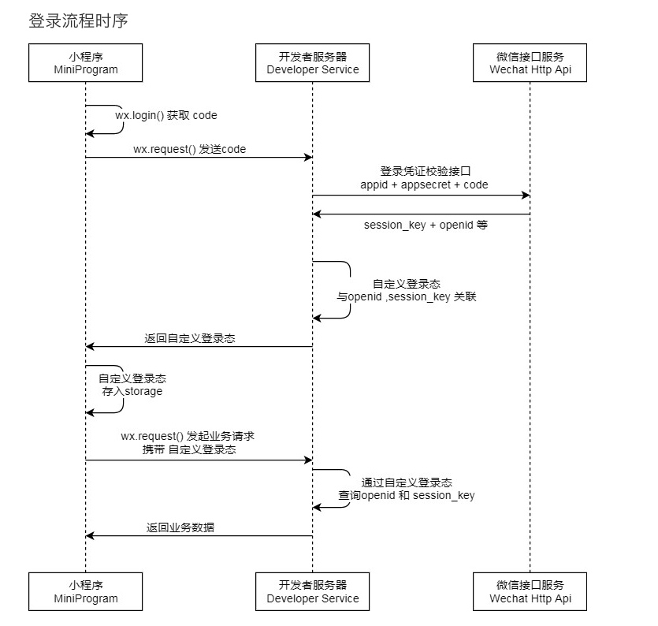
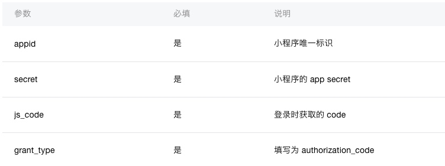
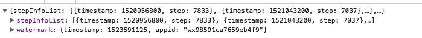
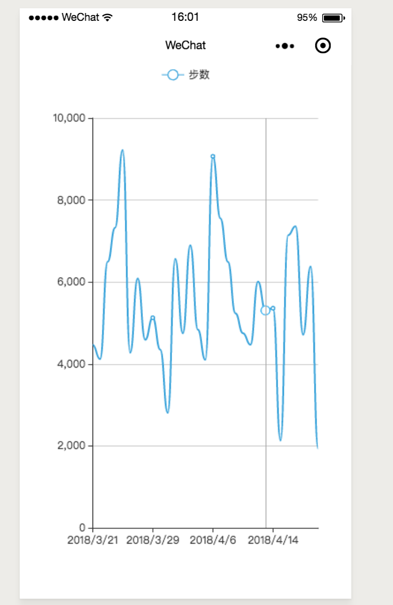

# 小程序的登录鉴权和数据解密

## 目录结构

```
├── dist                   小程序运行代码目录
├── node_modules           服务依赖包
├── images                 md文件所用图片
├── server                 服务端文件夹
|   ├── index.js           启动服务
|   ├── WXBizDataCrypt.js  微信官方解密算法
└── package.json           项目的package配置
```

## 准备

1、因为用到了koa2框架，请确保node版本是为8+

2、将项目里面的`appid`和`secret`替换成自己的密钥

3、`npm i`下载依赖包

4、`npm run start`启动服务

5、查看本地ip地址，替换小程序的请求地址


## 登录流程



上图是官方给出的登录流程，我们来捋下逻辑。

1、用户使用`wx.login`获取临时`code`,有效期为5分钟

2、将临时`code`传到我们自己的后端服务，调用微信的API获取用户的`session_key`和`openid`

3、后端自定义新的密钥并关联返回的`session_key`和`openid`，将新的密钥返给前端

4、前端发送请求的时候，带着密钥，后端进行解析后返回数据


## session_key和openid

1、`session_key`会话密钥，用来确定会话的操作的有效性和用来加密解密用户数据，服务器自己存储即可，不应该将密钥返给前端和对话使用

2、`openid`用户唯一标识，同样只用于服务器,可以用来标识用户的唯一性


接下来，我们说下它们的获取,通过服务端调用微信API获取

API：`https://api.weixin.qq.com/sns/jscode2session`

参数如下：




```
// 小程序页面
wx.login({
	success:(ret)=>{
		wx.request({
			url: 'http://test.com', // 后端服务器
			data:{
				code : ret.code
			}
		})
	}
})

```

后端服务我们使用`request`模块来发送请求

```
// 后端服务
let options = {
  url: 'https://api.weixin.qq.com/sns/jscode2session',
  qs:{
      appid: appid,  
      secret: secret,
      js_code: code,
      grant_type:'authorization_code'
  }
}

// 默认请求方式是get
request(options, (err, response, body) => {
	if(err) return err
	return body  // {openid:'openid', session_key:'session_key'} 不是真正的返回 看下面的代码
})

```


## 生成新的密钥 skey

上面我们获取了session_key和openid，下文两个字断称keyID，接下来我们生成一个新的密钥返回前端并将新密钥关联keyID。

我们使用crypto模块的sha1算法生成密钥

```
const crypto = require('crypto')

function getShaKey(data){
	return crypto.createHash('sha1').update(data, 'utf8').digest('hex')
}
```

上面的代码返回我们就改成这个新的skey，前端将这个密钥存在storage里面，请求的时候带上这个skey，就完成了自定义登录态。


## wx.checkSession

用来校验当前用户的session_key是否有效，微信不会把session_key的有效期告知开发者，用户越频繁使用小程序，session_key有效期越长。

```js
wx.checkSession({
	success:function(){  // 当前session_key有效
		... // 可以写我们的业务代码
	},
	fail:function(){   // 当前session_key已过期
		wx.login()  // 重新登录，获取新的session_key
	}
})
```

当session_key过期的时候，我们调用登录API，更新session_key生成新的skey，并关联二者关系。

## 工具函数的封装

前面我们将流程大概串了下，接下来我们把上面的流程写成代码

```js

// 验证session_key状态
function checkSession(){
	return new Promise((resolve, reject) => {
		wx.checkSession({
			success:function(){
				resolve(true)
			},
			fail:function(){
				reject(false)
			}
		})
	})
}

// 登录

function login(){
	return new Promise((resolve, reject) => {
		wx.login({
			success: (ret) => {
				wx.request({
					url:'本地服务地址',
					method: 'POST',
					data:{
						code: ret.code
					},
					success: (response) =>{
						wx.setStorageSync('skey', response.data.key)  // 将skey存在storage里面
						resolve(response.data.key)
					}
					
				})
			}
		})
		
	})
}

// 请求

function ajax(url, data, method="GET", config={}){
	let skey = wx.getStorageSync('skey') // 获取skey
	if(!skey){  // 没有skey，首次登录
		return new Promise((resolve, reject) => {
			login()
			reject('请登录')
		})
	} else {
		return new Promise((resolve, reject) => {
      checkSession().then( _=> {
        if (_){ // session_key有效
          wx.request({
            url,
            method: method.toLocaleUpperCase(),
            data,
            header: Object.assign({}, { skey }, config),
            success: (ret) => {
              resolve(ret.data)
            }
          })
        } else { // session_key失效
          login()
          reject('session_key失效')
        }
      })
    })

	}
}

```


## 后端代码

后端使用[koa框架](https://koa.bootcss.com/#)


## 解密

官方提供了多种编程语言的示例代码[点击下载](https://developers.weixin.qq.com/miniprogram/dev/demo/aes-sample.zip)

这里我们使用微信运动API为例

```
var app = getApp()  // 我们将工具函数都放在了app的示例上面
Page({
	onLoad:function(){
		app.Util.login().then(_ => {  // 先登录然后获取数据
      this.getrunData()
    })
	},
	getrunData(){
    wx.getWeRunData({
      success: (ret) => {
        app.Util.ajax('本地服务地址', { iv: ret.iv, data: ret.encryptedData}, 'post').then(_=>{
          console.log(_)
        }, (err)=>{
          console.log(err)
        })
      }
    })
  },

})

```

返回结果如下



## 效果图

